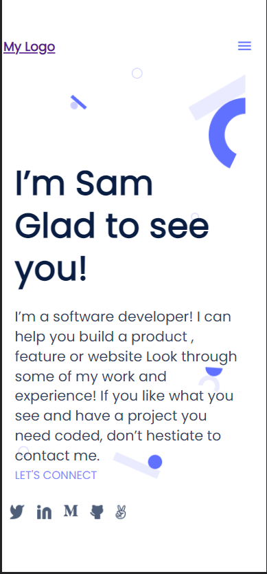
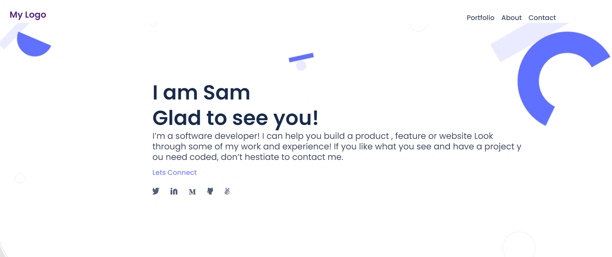

# Personal Portfolio project (mobile version)

> This project involves creating a basic mobile version portfolio skeleton which will be used in the development of a complete personal portfolio accessible both through phone and desktop.

## Mobile Version screenshot

## Desktop Version screenshot

Additional description about the project and its features.

## Built With

- HTML
- CSS
- JAVASCRIPT

## Live Demo

[Live Demo Link](https://mosams.github.io/Personal-Portfolio/)

To get a local copy up and running follow these simple example steps.

### Prerequisites

### Setup

### Install

### Usage

### Run tests

### Deployment

## Authors

👤 **Author1**

- GitHub: [@githubhandle](https://github.com/Mosams/)
- Twitter: [@twitterhandle](https://twitter.com/sam_mongare)
- LinkedIn: [LinkedIn](https://www.linkedin.com/in/sammy-mongare-b8288310b/)

## 🤝 Contributing

Contributions, issues, and feature requests are welcome!

Feel free to check the [issues page](../../issues/).

## Show your support

Give a ⭐️ if you like this project!

## Acknowledgments

- Hat tip to anyone whose code was used
- Inspiration
- etc
